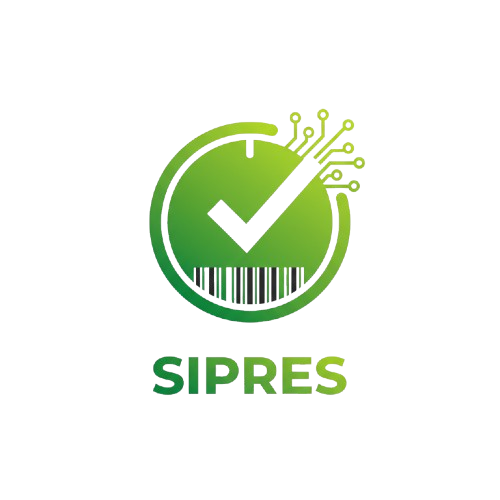

<div align="center">
    
    &nbsp;&nbsp;&nbsp;&nbsp;
    
</div>

<div align="center">
    <h1 style="margin-top: 10px;">SIPRES</h1>
    <p>
        <strong>Sistem Presensi Acara Berbasis QR Code</strong><br>
        Dikembangkan untuk <i>BKPSDM Kabupaten Karawang</i>
    </p>

  <a href="https://laravel.com">
    
  </a>
  <a href="https://getbootstrap.com">
    
  </a>
  <a href="https://www.mysql.com/">
    
  </a>
</div>

<br>

## 📖 Tentang SIPRES

**SIPRES** adalah sistem presensi digital yang mentransformasi metode absensi konvensional menjadi digital melalui pemindaian **QR Code**. Sistem ini dibangun khusus untuk lingkungan **BKPSDM Kabupaten Karawang** guna meningkatkan efisiensi, akurasi, dan transparansi data kehadiran dalam setiap kegiatan kedinasan.

## 🚀 Fitur Utama

| Fitur | Deskripsi |
| :--- | :--- |
| 📱 **QR Code Attendance** | Absensi instan (scan-and-go) menggunakan kode QR unik. |
| 📅 **Event Management** | Pengelolaan jadwal acara, lokasi, dan sesi istirahat. |
| 👥 **Integrasi Pegawai** | Sinkronisasi otomatis dengan master data pegawai (NIP/Nama). |
| 📨 **Broadcast QR** | Kirim undangan & QR Code massal via Email atau WhatsApp. |
| 🪪 **ID Card Generator** | Cetak ID Card peserta lengkap dengan QR Code otomatis (PDF). |
| 📊 **Real-time Stats** | Dashboard statistik kehadiran per SKPD secara langsung. |
| 🔄 **Riwayat Data** | Log aktivitas perubahan data peserta (Audit Trail). |

## 🛠️ Teknologi

Sistem ini dibangun menggunakan teknologi yang handal dan aman:

* **Core:** Laravel Framework
* **Database:** MySQL
* **Frontend:** Bootstrap 5, Vanilla JS (ES6), Blade Templates
* **Modules:**
    * `barryvdh/laravel-dompdf` (Export PDF)
    * `simplesoftwareio/simple-qrcode` (QR Generator)

## 📦 Instalasi

Pastikan server lokal Anda telah memenuhi syarat kebutuhan Laravel.

1.  **Clone Repositori**
    ```bash
    git clone [https://github.com/username/sipres.git](https://github.com/username/sipres.git)
    cd sipres
    ```

2.  **Instal Dependensi**
    ```bash
    composer install
    npm install && npm run build
    ```

3.  **Konfigurasi Environment**
    ```bash
    cp .env.example .env
    php artisan key:generate
    # Jangan lupa sesuaikan konfigurasi DB di file .env
    ```

4.  **Migrasi Database**
    ```bash
    php artisan migrate
    ```

5.  **Jalankan Aplikasi**
    ```bash
    php artisan serve
    ```

## 🔒 Keamanan & Lisensi

Jika menemukan celah keamanan, harap laporkan segera ke pengembang. Aplikasi ini dilisensikan di bawah **[MIT License](https://opensource.org/licenses/MIT)**.

---

<div align="center">
    <small>&copy; 2025 BKPSDM Kabupaten Karawang. Created by <strong>SIPRES</strong>.</small>
</div>